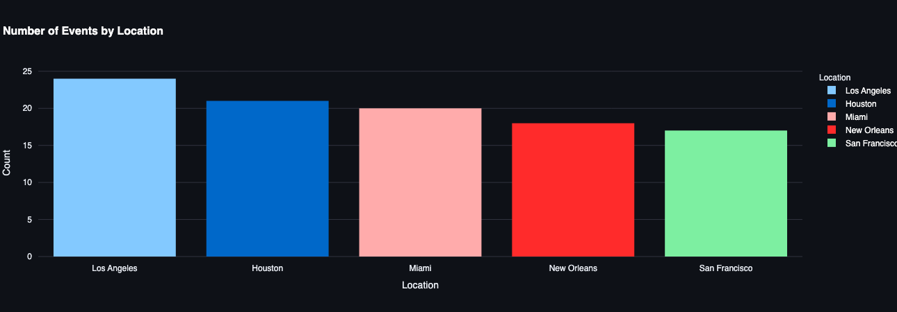

# Nadis: A Real-Time Detection of Natural Disasters from Social Media Data Using Deep Learning

The current emergency response infrastructure is efficient to an extent but can be improved, eliminating significant delays in disaster detection and reporting mechanisms. Social media is an exceptional tool for providing real-time disaster detection. However, social media content is vast, and extracting reliable information can take time and effort. This project efficiently filtered, classified, and extracted valuable insights from social media data using advanced deep-learning models to facilitate the effectiveness of early warning systems. The project developed a system called Nadis, which aims to improve the efficiency of natural disaster detection.

## Objectives

1.	Real-time data collections: Gather social media posts using Twitter API to obtain real-time textual and multimedia content streams.
2.	Information extraction: Implement NLP techniques to extract critical information such as location, disaster severity, and event time.
3.	Disaster classification: Develop a deep learning model to classify posts into disaster categories, e.g., earthquakes, floods, hurricanes, or non-disaster content.
4.	Visualization and alerts: Create a dashboard to visualize real-time detection results and notify stakeholders.

## Results

